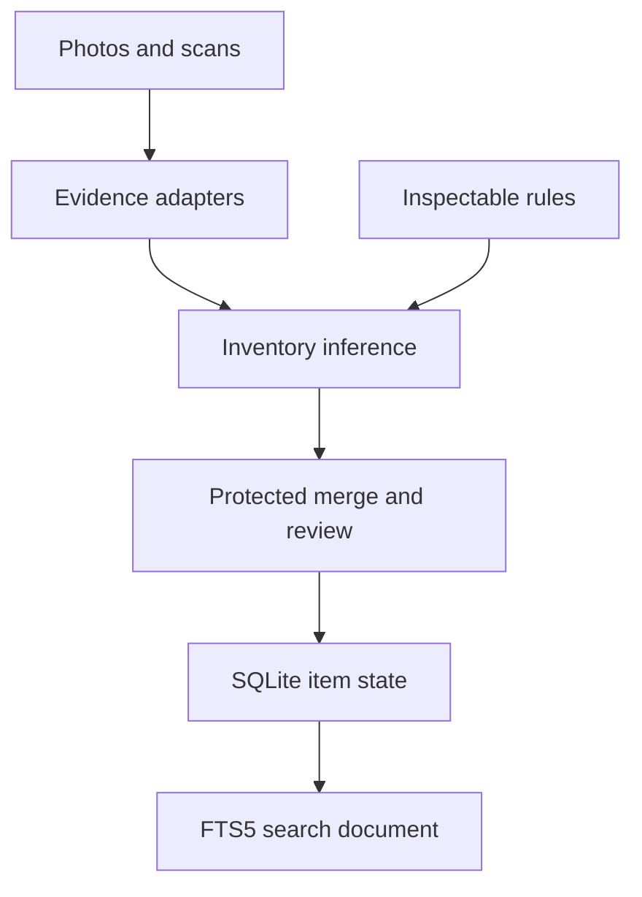

# WolfeVault Inventory, Learning, and Search Intelligence Design

## Repository Boundary

This design applies only to `Wolfechelios/Vault-Collector-Pro` (WolfeVault). No code, schema, branch, naming, or assumptions may be imported from unrelated inventory applications.

## Goal

Turn WolfeVault's capture pipeline into a local-first evidence system that can extract inventory fields, protect user-entered data, learn transparent preferences from corrections, and search the complete catalogue offline with deterministic natural-language filters.

## Shared Architecture

All three subsystems share one field-evidence contract and one SQLite source of truth. Capture providers emit evidence; Inventory Intelligence fuses evidence into reviewable suggestions; the Learning Engine contributes explicit rules; accepted item state is projected into the FTS5 search document. No subsystem writes directly around this flow.

## Inventory Intelligence

Evidence adapters may report OCR text, barcode values, logos, model numbers, serial numbers, years, editions, sizes, colors, materials, conditions, and category candidates. Every evidence record stores its source kind, source media identifier, raw text, normalized value, confidence, and optional bounding box.

The inference engine groups evidence by field, records conflicts, and creates field suggestions with one of three deterministic dispositions:

- High confidence (`>= 0.90` with no material conflict): apply automatically only when the destination is empty and unprotected.
- Medium confidence (`>= 0.65` and `< 0.90`): stage the value and mark it visibly for confirmation.
- Low confidence (`< 0.65`) or conflicting evidence: send it to review without changing item state.

User-entered and verified values are protected. Suggestions cannot silently replace them regardless of confidence. A user may explicitly accept a replacement through review. Each resulting field state preserves its verification state and winning evidence relationship.

Category schemas define common and category-specific fields. The item editor renders the selected schema dynamically and preserves unknown specifics during category changes.

## Learning Engine

The Learning Engine records accepted suggestions, edited suggestions, rejected suggestions, preferred categories, storage choices, provider routing, and title formatting. It converts repeated decisions into local rules such as OCR aliases, category preferences, storage routing, provider routing, and title templates.

Rules are SQLite records with conditions, actions, priority, evidence count, enabled state, and human-readable explanation. They are inspectable, editable, disableable, and removable. Suggestions list every rule that influenced their output. Private inventory is never uploaded for opaque model training.

## Search Intelligence

The search document contains title, description, OCR text, identifiers, notes, category, condition, specifics, tags, and complete storage path. SQLite FTS5 provides ranked offline text retrieval. Structured filters support value, year, quantity, status, condition, category, location, missing-photo state, review state, and listed state.

The natural-language parser is deterministic. It recognizes quoted text, category and condition vocabulary, comparison phrases, locations, missing-field phrases, listing state, grading expressions, and year/value/quantity comparisons. It returns both normalized filters and unconsumed free text so results are reproducible and explainable.

Saved searches, recent searches, and smart collections are stored locally. Required smart collections include unpriced, unassigned, duplicate, missing-photo, and review-needed.

## Persistence

New rollback-safe migrations add:

- `scan_evidence`
- `field_suggestions`
- `item_field_state`
- `category_field_definitions`
- `correction_rules`
- `learning_events`
- `search_documents` and its FTS5 virtual table
- `saved_searches`
- `search_history`
- background reindex queue and triggers

Migrations are idempotent and applied transactionally. Existing data is backfilled without replacing current item values.

## UI

The desktop app adds:

- Scan Review workspace with confidence bands, conflict state, accept/edit/reject actions, and source-photo evidence viewer.
- Dynamic category-specific fields in the item editor.
- Learning Rules manager showing rule explanation, origin, use count, priority, and enabled state.
- Global command/search bar with parsed-filter explanation.
- Search results in cards, table, and a dense “messy closet” view.
- Smart collections for unpriced, unassigned, duplicate, missing-photo, and review-needed items.

Medium-confidence values remain visibly flagged until verified. Protected user values display a lock state whenever a suggestion targets them.

## Branch and Release Strategy

The three systems ship as one integrated release on `feature/inventory-intelligence-release`. They share the same evidence model, persistence migration, review flow, learning influence trace, and FTS5 projection, so splitting them would create incomplete intermediate states. One pull request carries the complete release and must pass SQLite migration/FTS tests, Rust tests, desktop UI tests, desktop/mobile builds, and all GitHub Actions checks. Nothing merges while any required check is failing.

## Acceptance Criteria

- Every proposed field is traceable to evidence and confidence.
- Protected values never change without explicit approval.
- Category-specific fields render from data, not hard-coded editor branches.
- Every learned recommendation cites its influencing rule.
- Search examples such as `yellow DeWalt drill`, `coins before 1900 worth over $500`, `items missing photos`, `everything in Garage Shelf B`, and `PSA 10 cards not listed` compile into deterministic filters.
- Full inventory search continues to work with all networking disabled.
- Existing capture, valuation, marketplace, storage, import, and backup features remain working.
